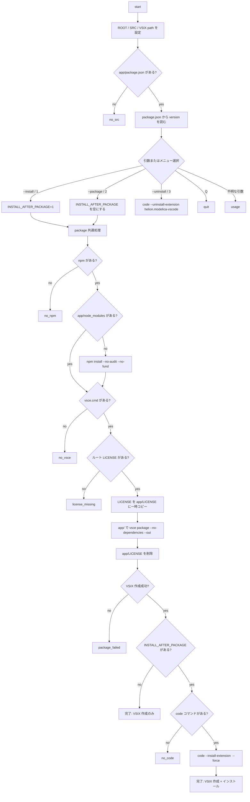

# install.bat Workflow

`install.bat` は、`app/` を VS Code 拡張機能として VSIX 化し、必要に応じてその VSIX をローカル VS Code にインストールするためのスクリプト。

配布実体は `.vsix-build/helion.modelica-vscode-<version>.vsix`。`.modelica-build/` は Modelica のコンパイル/シミュレーション成果物用に使う。

## Commands

| コマンド | 動作 |
|---|---|
| `install.bat` | メニューを表示 |
| `install.bat --install` | VSIX を作成して VS Code にインストール |
| `install.bat --package` | VSIX 作成のみ |
| `install.bat --uninstall` | VS Code から拡張機能をアンインストール |

## Workflow

## Package Flow

`--install` と `--package` は途中まで同じ処理を通る。

1. `npm` を確認する。
2. `app/node_modules` がなければ `npm install --no-audit --no-fund` を実行する。
3. `app/node_modules/.bin/vsce.cmd` を確認する。
4. ルート `LICENSE` を `app/LICENSE` に一時コピーする。
5. `app/` で `vsce package --no-dependencies --out "%VSIX%"` を実行する。
6. `app/LICENSE` を削除する。
7. `--package` ならここで終了する。
8. `--install` なら `code --install-extension "%VSIX%" --force` を実行する。

`vsce package` は `app/package.json` の `vscode:prepublish` を実行するため、そこで `npm run rebuild` が走る。配布に不要なファイルは `app/.vscodeignore` で除外する。

## License Handling

ライセンスの正本はリポジトリ直下の `LICENSE`。

VSIX 作成時だけ `app/LICENSE` として一時コピーする。`vsce` はこれを VSIX 内の `LICENSE.txt` として同梱する。作成後、`app/LICENSE` は削除する。

## Error Labels

| ラベル | 主な原因 |
|---|---|
| `no_src` | `app/package.json` がない |
| `version_failed` | `package.json` から version を読めない |
| `usage` | 不明な引数 |
| `no_npm` | `npm` が PATH にない |
| `no_vsce` | `app/node_modules/.bin/vsce.cmd` がない |
| `license_missing` | ルート `LICENSE` がない |
| `license_copy_failed` | `app/LICENSE` への一時コピーに失敗 |
| `package_failed` | VSIX 作成に失敗 |
| `no_code` | `code` コマンドが PATH にない |
| `install_failed` | VSIX インストールに失敗 |
| `uninstall_failed` | 拡張機能のアンインストールに失敗 |
